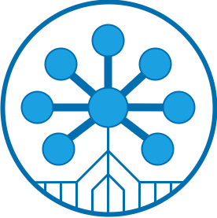
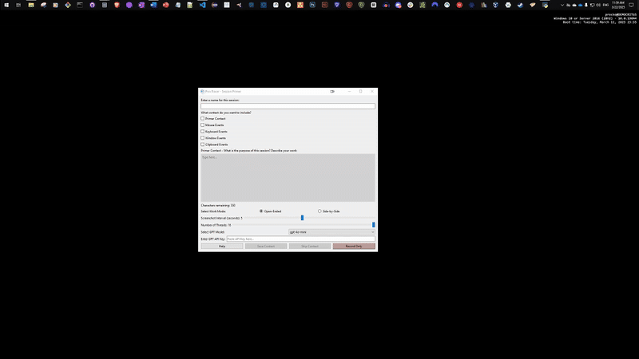
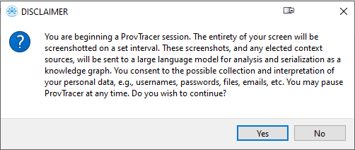
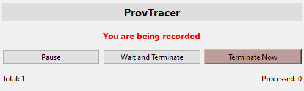
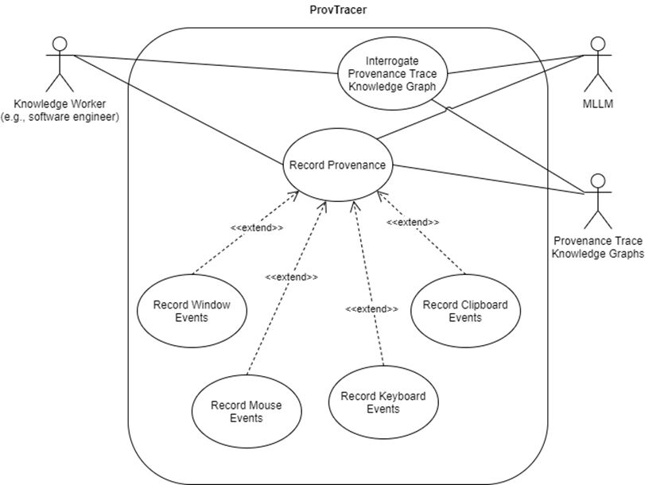
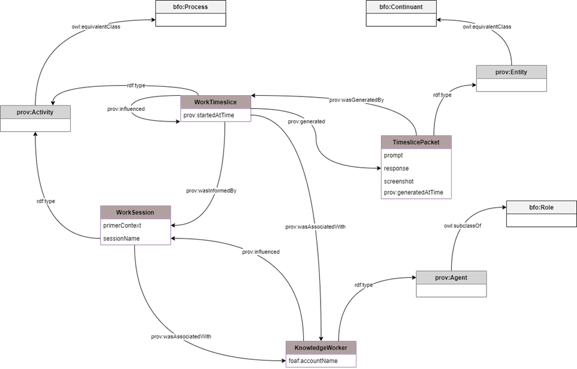
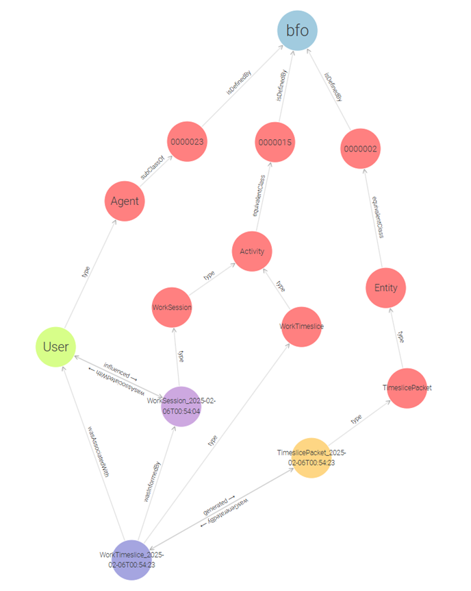
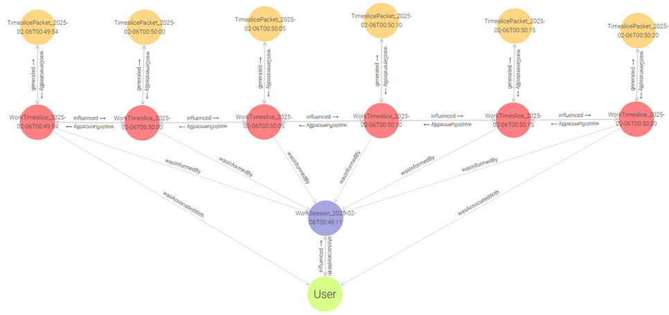
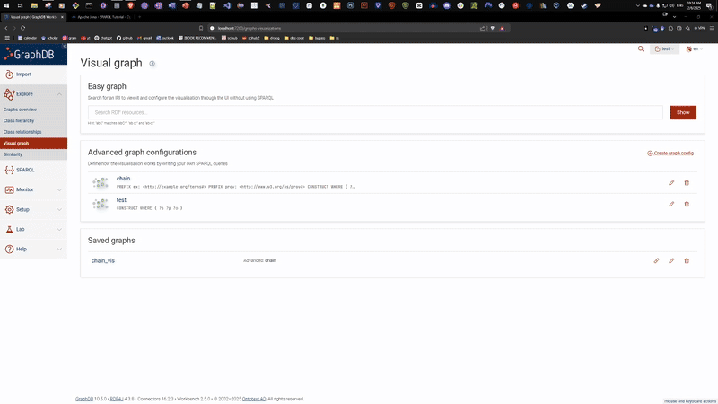

# ProvTracer

ProvTracer is a system developed to automatically capture digital artifact provenance by utilizing a multi-modal large language model (MLLM) and knowledge graph serialization.

The name of the system is an incorporation of the two disciplines underlying, to wit, the Semantic Web, which places great emphasis on provenance, e.g., with the PROV-O standard, and software engineering, which emphasizes traceability from requirements elicitation forward. ProvTracer is an approach at unifying these two concerns through the use of a capable MLLM.



- [ProvTracer](#provtracer)
- [Project Goal](#project-goal)
- [Requirements](#requirements)
- [Use](#use)
  - [Setup](#setup)
  - [Provenance Tracing](#provenance-tracing)
    - [Primer Window](#primer-window)
    - [Transition to Disclaimer Window](#transition-to-disclaimer-window)
    - [Disclaimer Window](#disclaimer-window)
  - [Insight Gathering](#insight-gathering)
    - [Ontology](#ontology)
- [Ancillaries](#ancillaries)
  - [ProvTracer Name and Logo](#provtracer-name-and-logo)

# Project Goal
ProvTracer is driven by an intent to address two key non-functional requirements (NFRs) in digital artifact work: traceability and explainability. Addressing these two help to address two others: reproducibility and transparency. As ProvTracer utilizes a standard ontology suite for its knowledge representation, the NFR of interoperability is addressed as well.

The goal of the ProvTracer project is summarized in the goal definition template of Wohlin et al. for experimentation in software engineering:

* To *analyze* the digital research process, in particular, the SDLC, *for the purpose of* evaluating and capturing relevant provenance sources *with respect to* their ability to engender transparency through explainable provenance traces, while avoiding information overload *from the point of view of the* software developers *in the context of* personal computer work.

# Requirements
* Requires Python and the PyQt6 UI library
* To install the necessary dependencies (just a few, most are Python built-ins), run ```pip install -r requirements.txt```

# Use
You can watch a video of how to use ProvTracer [here](https://youtu.be/wsgQWTsAlHc).

1. Make sure you installed the [required dependencies](#requirements)
2. Perform the [setup](#setup)
3. Fill out the [primer window](#primer-window) with, at minimum, your GPT API key
4. Three [options](#transition-to-disclaimer-window):
   1. Save context and proceed for a context-rich MLLM session (ideal)
   2. Skip context and proceed for a context-less MLLM session
   3. Record only for no MLLM involvement

## Setup
* Clone the repo (or just download all the files)
* Run main.py: ```python main.py```
* The system is UI-driven once started

## Provenance Tracing
Generating provenance traces is as easy as running the application and then working on your computer normally. ProvTracer does not interfere with regular computer work in any way. The means of beginning a work session is through the Primer Window.



### Primer Window
This is the first screen shown when the application starts. There are a number of options available to the user. All of them can be entirely skipped if desired by either clicking the Record Only button or the Skip Context button. But, more context is generally better for the MLLM to produce better responses.

* **Session Name**: This is recommended for organizational purposes. If a user generates many work sessions, having a useful, textual name can be beneficial for later retrieval.
* **Primer Context**: This is highly recommended for improving contextual input to the MLLM. A user should describe, to their best ability, exactly what sort of work is planned for the coming work session, why it is planned, what documents will be involved, and so on.
* **Mouse Events**: This is the least important context item, i.e., it provides the least influence or steerability onto the MLLM, because of the spatial reasoning limitation of most MLLMs.
* **Keyboard Events**: This is a very important context item, as it provides textual deltas between what is on screen and what was typed.
* **Window Events**: This is a very important context item, as it provides literal insight into the application titles being used.
* **Clipboard Events**: This is context item of middling concern, as it is not as consistent as, say, keyboard and window events; but it can be useful.
* **Work Mode**: Work modes are introduced to allow richer semantic depth to work sessions. There are two avaiable to choose:
  * **Open-Ended Mode**: the default in ProvTracer; for planned work involving several artifacts opened, closed and shifted through in no apparent order and with no obvious pattern; best for exploratory or otherwise normal work.
  * **Side-by-Side Mode**: for planned work primarily, if not entirely, composed of one part of the screen containing a source artifact, and the other containing a work artifact; best for planned, rigid development work
* **Screenshot Interval**: By default, ProvTracer takes a screenshot and timeslice packet every 5 seconds, but the user can adjust it from 1 to 10 seconds.
* **Number of Threads**: An asynchronous thread pool is used to handle file monitoring and MLLM prompting. By default, the number of threads in the pool is maximized to equal to the number of CPU cores on the host machine, to make the most of multithreading while not incurring the technical debt of context-switching. The user can adjust the number of threads from 1 down to the maximum.

Of greatest importance are the MLLM details:

* **GPT Model**: There are three MLLMs to choose from:

  * gpt-4o
  * gpt-4o-mini
  * gpt-4-turbo

By default, ProvTracer uses gpt-4o-mini because it is the fastest and cheapest MLLM.

* **GPT API Key**: This field is mandatory. Example GPT API keys may look like:

  * ```sk-3uTfHnLzOQm1VYk9W2XpPZB6lNm8XoRvEDjNQpM1GVga8yTr```
  * ```sk-proj-z8R6P1cMjYwD5AK7XvFhLTcJn9QvGwJMaD9XpzSotZc3PdqH```

Just paste yours in. Keep track of your own credits.

### Transition to Disclaimer Window
Once a user decides to move on from the Primer Window, this can be done in one of three ways:

* **Save Context:** All adjusted context is saved for use in the MLLM prompting. This is the ideal use of ProvTracer.
* **Skip Context:** Context is entirely skipped, i.e., the MLLM prompting only includes screenshots.
* **Record Only:** No MLLM prompting occurs, only screenshots and provenance (if selected) are recorded for later use.

The first two require the user to agree to a disclaimer message:



### Disclaimer Window



This window persists during a ProvTracer session, to ensure the user is not unaware of its status. The window is drawn atop all other screen elements but can be moved by clicking and dragging its top border. There are three buttons available:

* **Pause**: Allows the user to halt any new screenshot events; currently processing timeslice packets will still be processed. Can also be activated by pressing ```Ctrl + Shift + P```
* **Wait and Terminate**: Allows ProvTracer to halt any new screenshots but finish processing those that have not been. Effectively a "lazy termination" button.
* **Terminate Now**: Halts all execution and ends everything immediately.



## Insight Gathering
Once provenance trace knowledge graphs for a work session (or several of them) are acquired, they can be used to gather insight about the provenance of the work performed.

### Ontology


ProvTracer stores recorded provenance information by adhering it to an ontology based on PROV-O and the BFO. This retains semantic interoperability with a time-tested standard, PROV-O, as well as a futureproof outlook because of the BFO.

Output provenance trace link knolwedge graphs can be queried in the RDF query language, SPARQL, but this is manual and mundane. Much greater insight can be queried lexically by employing a LLM.

Each work timeslice is a small sub-graph of a greater chained whole. The following image is a singular work timeslice visualized in GraphDB:



The following image is a simplified work timeslice "chain" visualization representing a subset of a larger work session:



These are generated automatically when ProvTracer is run.



# Ancillaries
Uncategorized information dumped here.

## ProvTracer Name and Logo
The name of the system is an incorporation of the two disciplines underlying, to wit, the Semantic Web, which places great emphasis on provenance, e.g., with the PROV-O standard, and software engineering, which emphasizes traceability from requirements elicitation forward. ProvTracer is an approach at unifying these two concerns through the use of a capable MLLM and knowledge graphs.

The logo embodies the Semantic Web idea of "lifting" lower level data and information forms into a knowledge graph under a unified ontological basis.